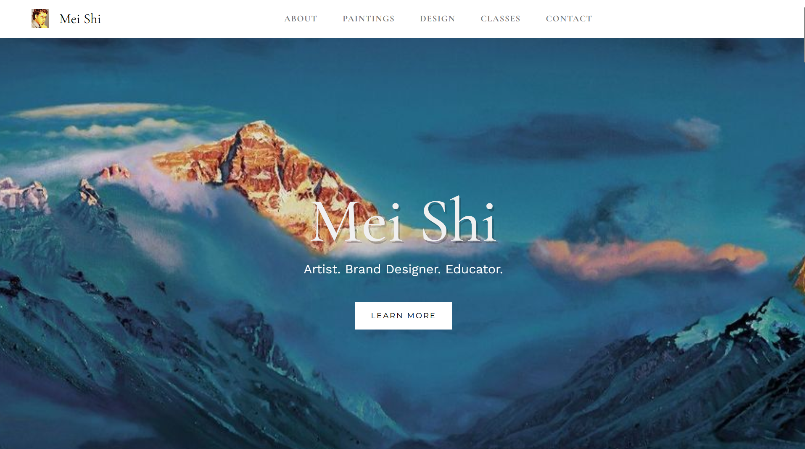

## Case Study: Art Gallery Website

**Mei Shi Gallery Website**

This case study brings you into the creative world of Mei Shi, where inspiration taken from nature’s mountain vistas and grand rivers merge with a spirit of relentless optimism and humanitarian progress. Mei is a prolific artist and brand designer, later turned arts educator. The scale of his rich life experiences, the extent of his bold vision, and essence of his ever-changing style is impossible to capture through a screen; this project takes a step towards capturing this character. Meet Mei Shi.

**Client and Idea**

Mei Shi (梅石), born Mei He Li Shi (梅赫理石) is a contemporary painter and famous brand designer. After immigrating to the United States in 2017, he won two national gold and silver awards in the Scholastic Art and Writing Awards. Mei Shi is also a neorealist painter and abstract expressionist painter. His paintings have been displayed by the International Union of Geological Sciences, Li Ka-shing and many other collectors. 

Combining the human aspects of gratitude with the awe-inducing nature of natural landscapes, Mei Shi has explored subjects across many art styles: shifting between realistic portraits, landscape studies, interactive experimental works, and abstract pieces. However, the one thing that remains constant across his range of artistic endeavors is the continuous path of striving towards free flowing expressions of beauty in all forms.

Inspiration and core visual ideas came from the ideals of hope, freedom, and awe conveyed by expansive natural landscapes.

[Live Website](https://meishi-art.webflow.io/)
