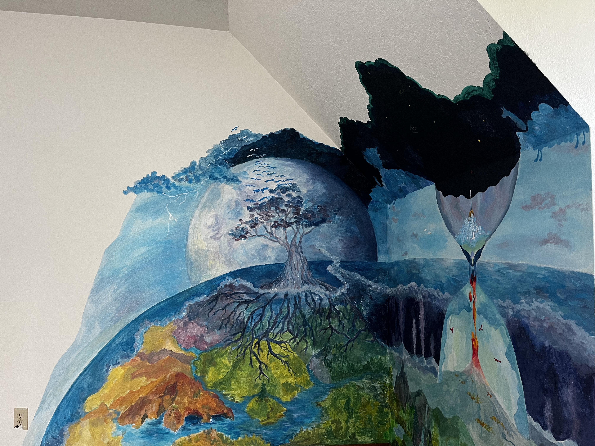

Taking a break from academics has helped me realize that success and fulfillment can be defined beyond the standards of pure intellectual achievement I once strived towards. Most of last year, I decided to isolate myself out of insecurity, and I've decided that it would be better to start sharing pieces of my work day by day as it happens. 

